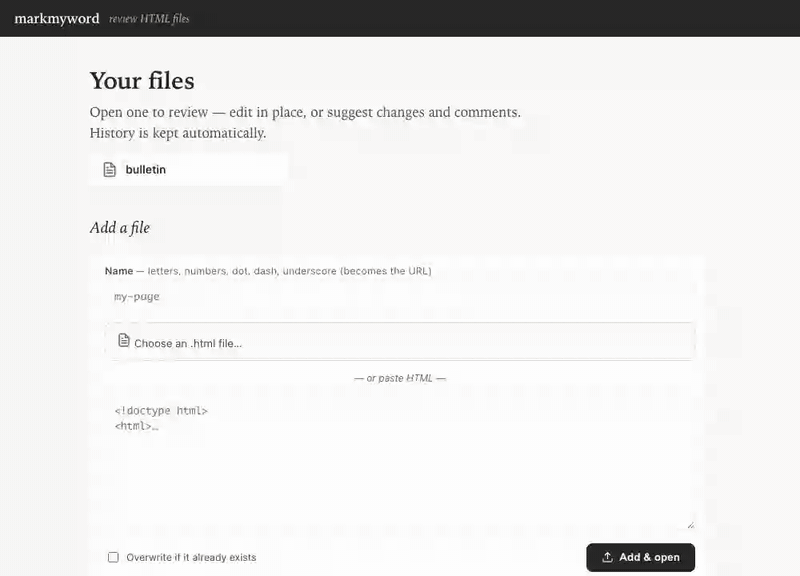
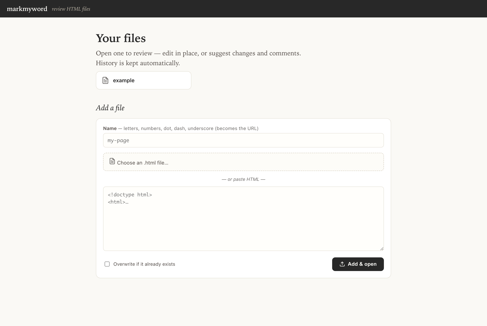
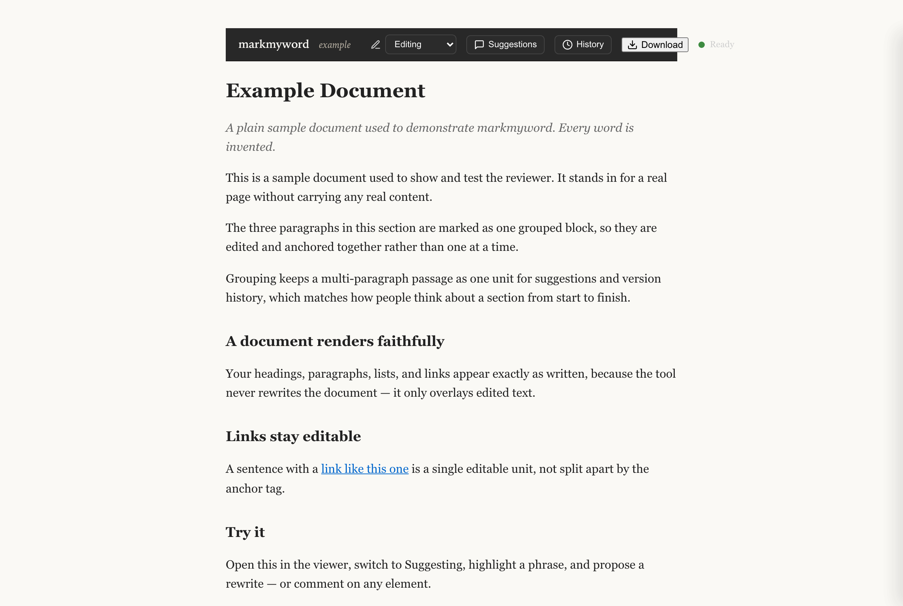
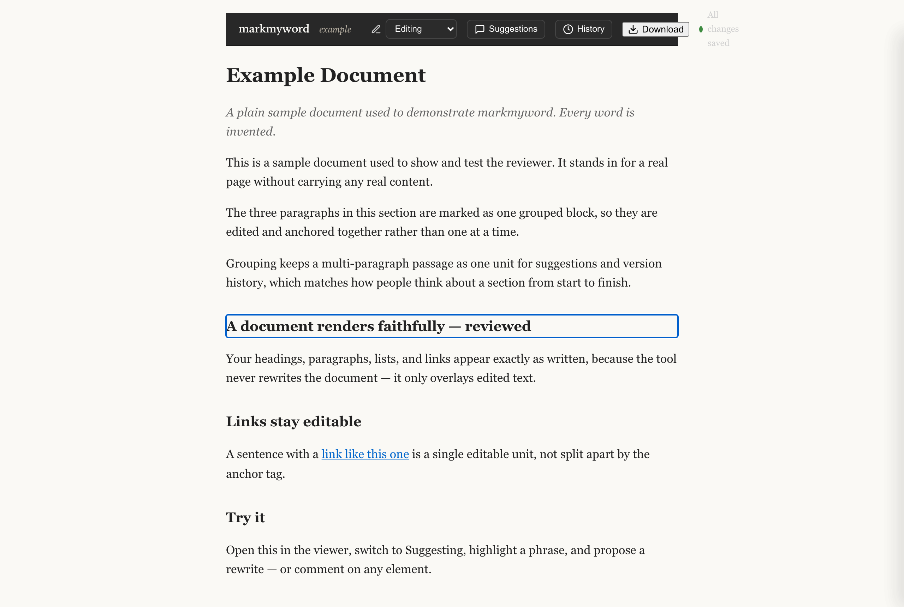
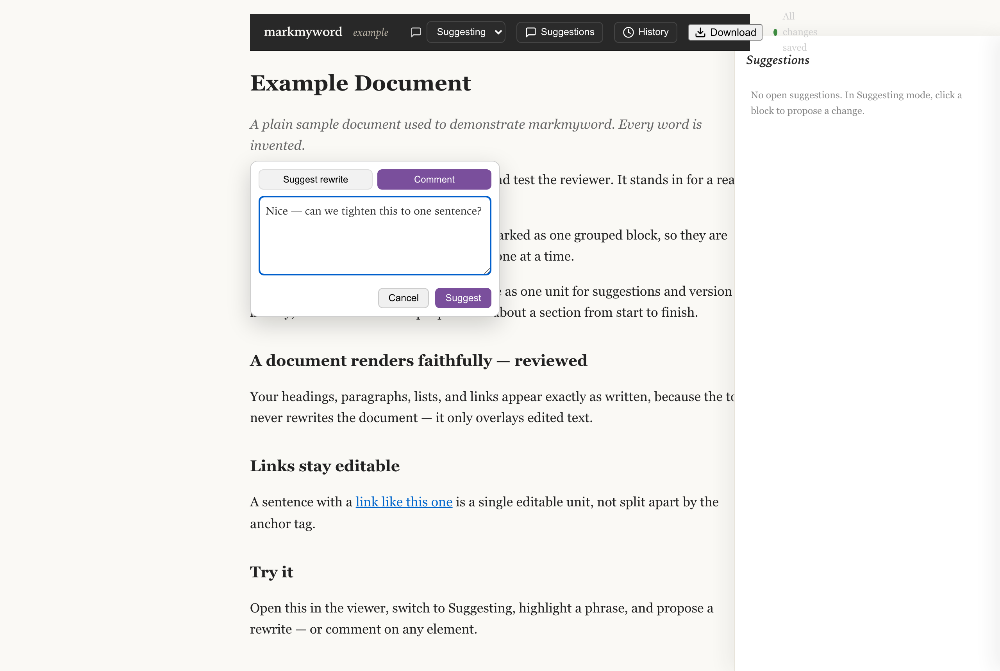
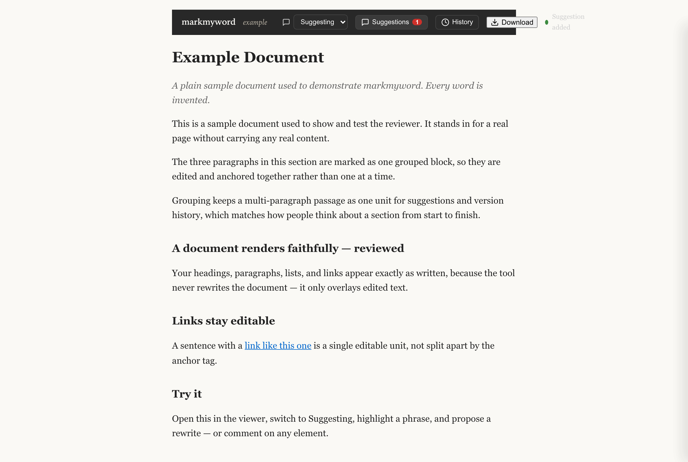
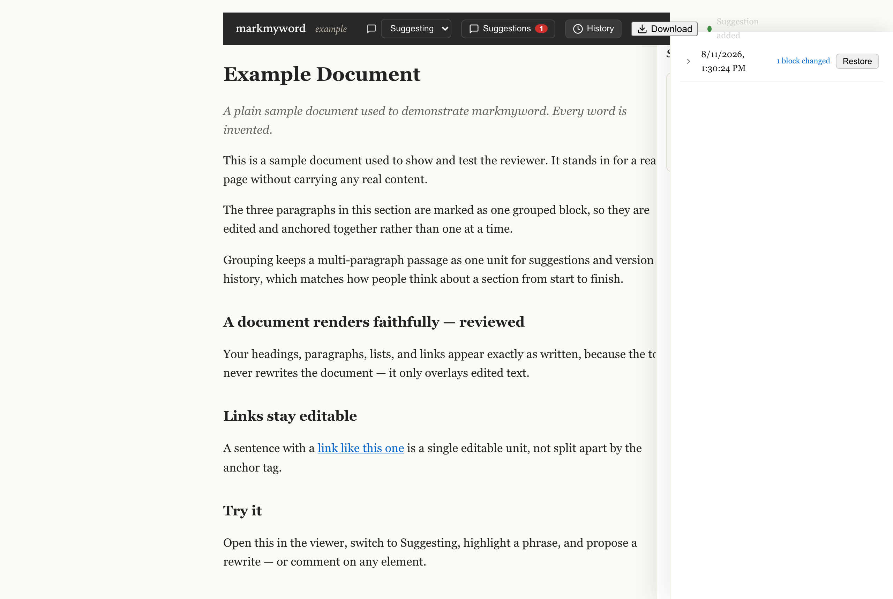

<div align="center">

# 📝 markmyword

**A Google-Docs-style review layer for your already-styled HTML.**

Newsletters, dashboards, one-pagers — rendered *exactly as authored*, with
edit-in-place, tracked suggestions, comments on anything, and automatic version
history layered on top. Your markup is never rewritten.

### 🔗 [**Try the live demo → markmyword.fly.dev**](https://markmyword.fly.dev/)

https://github.com/alexagriffith/markmyword/raw/main/docs/demo.mp4



</div>

---

## The problem

You built a beautiful HTML deliverable — custom CSS, a table-based email layout,
inline SVG charts. Now you need review.

- **Paste it into Google Docs** → the layout is flattened. Your design is gone.
- **Comment-on-live-page SaaS** → you get sticky-note comments, but no editable
  text and no history.
- **Email a diff / screenshots** → no one can actually *make* the change.

**markmyword** renders your artifact **as-is** and layers Google-Docs-style
review on top — without touching a single tag.

---

## 📖 User stories

markmyword is built around a simple split: **one owner edits, everyone else
suggests.** Here's how each person experiences it.

### 1. The owner — *"I want feedback on my HTML, fast."*

> *As the author of a styled HTML page, I upload it (or paste the markup), open
> it, and it renders exactly like the real thing. I can **edit text in place**
> like a doc — headings, paragraphs, links — and every change autosaves with
> **version history** I can restore. When I'm done, I **download the reviewed
> HTML** with all my edits baked back into the original markup.*

`Upload → edit in place → history is kept → download the clean result.`

### 2. The reviewer — *"I want to give feedback without an account."*

> *As a coworker, I click the link the owner shared. No login, no setup. I switch
> to **Suggesting** mode, highlight a phrase, and propose a rewrite — or leave a
> **comment on any element**, even an image or a chart. My suggestions show up as
> tracked changes the owner can accept or reject.*

`Open link → Suggesting mode → highlight & suggest, or comment → owner decides.`

### 3. The GitHub-connected owner — *"I want my repo to be the source of truth."* &nbsp;🔜 *coming next*

> *As the author, I connect my private GitHub repo. markmyword **imports** a
> document straight from the repo, keeps live review in the workspace, and when I
> accept changes it **commits them back** to the repo. GitHub stays the source of
> truth for the text; markmyword is the review surface on top of it.*

`Connect GitHub → import doc → review → auto-commit accepted edits back.`
*(Today: upload/paste in, download out. GitHub sign-in + import + push-back is
the next milestone.)*

---

## 🎬 Storyboard

**1 · Your files.** The home page lists everything you're reviewing. Add a file
by picking an `.html` or pasting markup.



**2 · It renders faithfully.** Open a file and it looks exactly as authored —
markmyword never restyles the document itself.



**3 · Edit in place.** In Editing mode, click any block and type. Changes
autosave; the dot shows saved / unsaved.



**4 · Suggest, don't just edit.** Switch to Suggesting mode, highlight a phrase,
and propose a rewrite — or leave a comment on any element.



**5 · Suggestions panel.** Every proposal lands here as a tracked change the
owner can accept or reject.



**6 · Version history.** Every save is a restorable snapshot — see what changed
and roll back with one click.



**7 · Download the result.** Export the reviewed HTML with your edits baked back
into the original markup — no markmyword attributes leak.


---

## 🔒 Why it's safe to point at any HTML

- **Your document markup is never rewritten.** Edits are stored as plain text and
  re-applied as `textContent`, so tags, inline styles, and layout are untouched —
  and text injection is impossible.
- **Content-hash anchoring:** each editable block is addressed by a hash of its
  normalized text (+ an occurrence index), so edits and suggestions survive the
  template being restructured. If a block can't be re-anchored, its overlay is
  flagged **stale** and *not* applied — never mis-placed.
- **Uploads are script-stripped** server-side (`<script>`, `on*=` handlers,
  `javascript:` URLs) so a stored file is inert.
- **Reviewer text is untrusted:** suggestions and comments are escaped on store
  and rendered as text.
- **Only the owner applies changes.** Anyone with the link can *suggest*, but
  editing in place, restoring a version, and accepting or rejecting a suggestion
  are gated to the document's owner — a reviewer can propose, never overwrite.
- **Doc ids** are restricted to `[A-Za-z0-9._-]` (no path traversal).

---

## 🚀 Two ways to use markmyword

### A) Use the hosted demo — nothing to install

Just open **[markmyword.fly.dev](https://markmyword.fly.dev/)**.

- **To review:** click a shared link, no account needed. Switch to *Suggesting*,
  highlight text, propose a rewrite, or comment on any element.
- **To add your own file:** on the home page, name it, pick an `.html` file or
  paste markup, and hit **Add & open**.

> **Guest limits on the shared demo** (so it stays fast and cheap for everyone):
> each guest can have **1 file** at a time (delete it to add another), the demo
> holds a limited number of guests, files are capped at **2 MB**, and requests
> are rate-limited. Want more? Run your own instance (below) — you set the limits.

### B) Run it locally

```bash
npm install
npm start           # http://localhost:3939
# home (list + add):   http://localhost:3939/
# a specific file:     http://localhost:3939/viewer.html?doc=example
```

An `example` document ships in `docs/` so it works out of the box.

- **Home page (`/`)** lists every file in `docs/` and has an add form.
- Or drop `docs/<id>.html` in directly and open `/viewer.html?doc=<id>`.
- Optional grouping: `docs/<id>.config.json` `{ "groups": ["<css selector>"] }`
  edits a multi-element section as one block.

---

## 🛠️ Set up your own instance

markmyword is a small stateful Node app. Anyone can stand up their own copy —
here's the fastest path, on **Fly.io** (a `Dockerfile` + `fly.toml` ship in the
repo). Any always-on host with a persistent disk works the same way.

```bash
# 0. get the code + the Fly CLI (https://fly.io/docs/flyctl/install/)
git clone https://github.com/alexagriffith/markmyword.git && cd markmyword

# 1. create the app + a persistent volume for SQLite and uploaded files
fly launch --no-deploy            # pick a name + region; keep the generated fly.toml
fly volumes create markmyword_data --size 1 --region <your-region>

# 2. set secrets (see the table below). OWNER_KEY makes YOU the owner.
fly secrets set SESSION_SECRET=$(openssl rand -hex 32) OWNER_KEY=$(openssl rand -hex 24)

# 3. ship it
fly deploy
```

Then open your app URL. To act as the **owner** (unlimited files, exempt from the
guest cap and rate limits), append your key once: `https://<you>.fly.dev/?key=<OWNER_KEY>`.
markmyword sets a cookie so the tab stays owner; share the plain URL (no key) with
reviewers.

### Configuration (env vars)

| Var | Default | What it does |
|-----|---------|--------------|
| `OWNER_KEY` | *(unset → owner mode off)* | Secret that promotes a visitor to **owner** via `?key=…`. Unlimited files, no rate limit. |
| `SESSION_SECRET` | *(random per boot)* | Signs the owner/guest cookies. Set a stable value in production. |
| `MMW_GUEST_DOC_LIMIT` | `1` | Files a single guest may own at once. |
| `MMW_MAX_GUEST_OWNERS` | `15` | Max distinct guests on the box. |
| `MMW_MAX_DOC_BYTES` | `2000000` | Per-file size cap (bytes). |
| `MMW_READ_PER_MIN` | `300` | Read requests per minute per IP. |
| `MMW_WRITE_PER_MIN` | `60` | Write requests (edit/suggest/…) per minute per IP. |
| `MMW_UPLOAD_PER_HOUR` | `10` | Uploads per hour per IP. |
| `HS_DB_PATH` | `./data/app.db` | SQLite file location (point at the volume). |
| `HS_DOCS_DIR` | `./docs` | Where document files live (point at the volume). |
| `PORT` / `HOST` | `3939` / `0.0.0.0` | Bind address. |

Backup = copy `app.db` off the volume. Add a built-in file = commit
`docs/<id>.html`.

---

## 🧭 How it works

```
Browser  (viewer.html + viewer.js + anchoring.js)
  render base HTML faithfully · content-hash anchor each text leaf · apply overlay
  editor: contenteditable, debounced save · reviewer: select → suggest / comment
  download: re-apply overlay to base markup, strip markmyword attrs, save file
        │  GET /api/doc/:id  POST /api/edit/:id  POST /api/suggest/:id  …
        ▼
Node (Express)  — one always-on process
  strip active content on upload · escape reviewer text · anchor hydration
        │  better-sqlite3 (synchronous, ACID)
        ▼
SQLite  app.db  — overlay (live text) · document_versions (history) · suggestions
docs/<id>.html  — immutable base templates (git versions the templates)
```

**Two storage systems, on purpose:** the base HTML lives as a file (the source of
truth for markup); the live review state — edits, suggestions, history — lives in
SQLite. That's why review data survives across sessions and why GitHub can later
own the documents while the workspace owns the in-flight review.

---

## 🧪 Test

```bash
npm test    # anchoring (jsdom) + format probes + grouping
            # + API / suggestions / upload round-trips (Express + SQLite)
```

---

## ☁️ Deploy

markmyword is a **stateful** app: a long-running Node process plus a SQLite file
it writes to continuously. It needs an **always-on host with a persistent disk**
(Fly.io, Render, Railway, or any VM) — *not* a static host (GitHub Pages) or a
serverless platform with an ephemeral filesystem (Vercel), where writes are lost.

This repo ships a `Dockerfile` and `fly.toml`; the live demo runs on Fly.io with a
persistent volume. Backup = copy `data/app.db` off the volume. Add a file = commit
`docs/<id>.html`.

---

## License

MIT — see [LICENSE](LICENSE).
